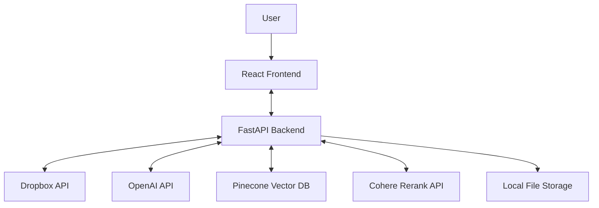
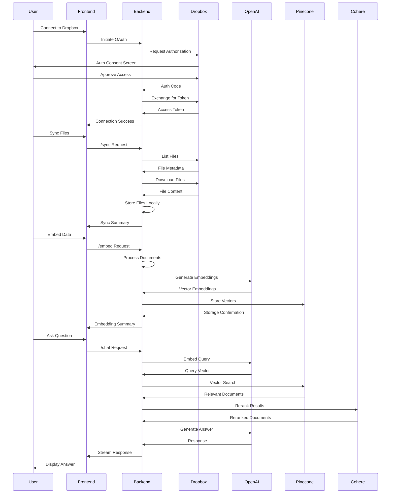
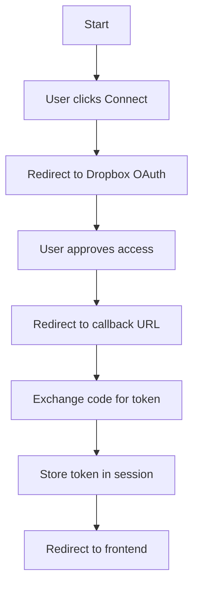
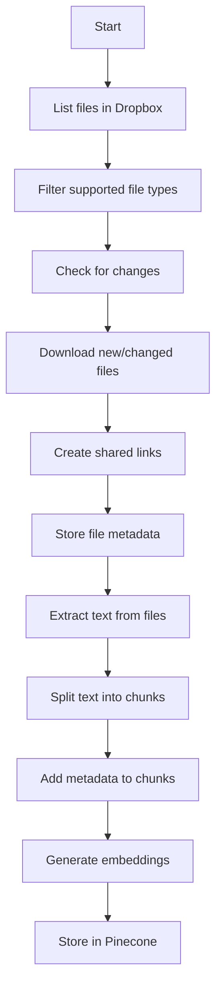
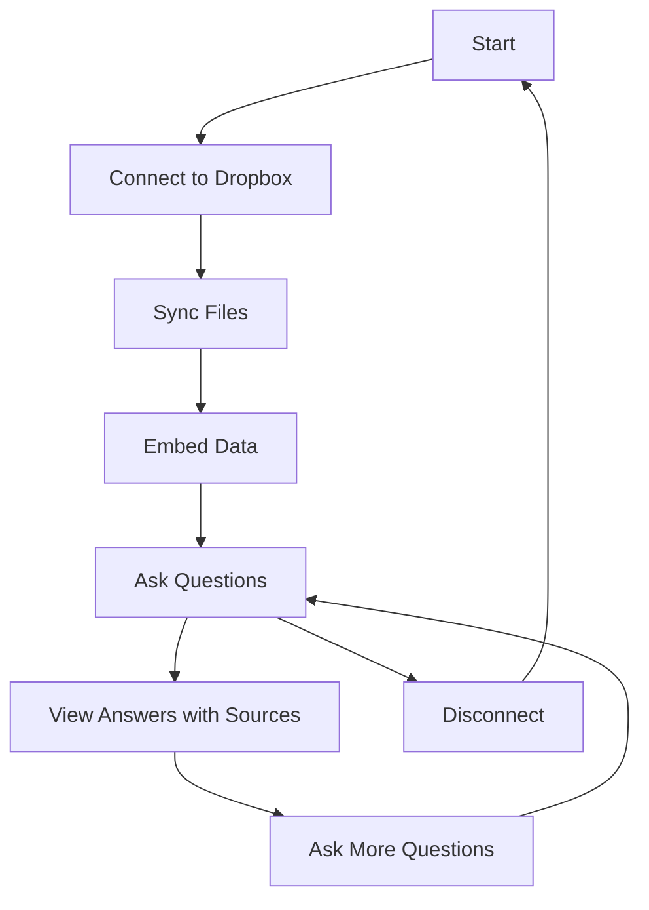
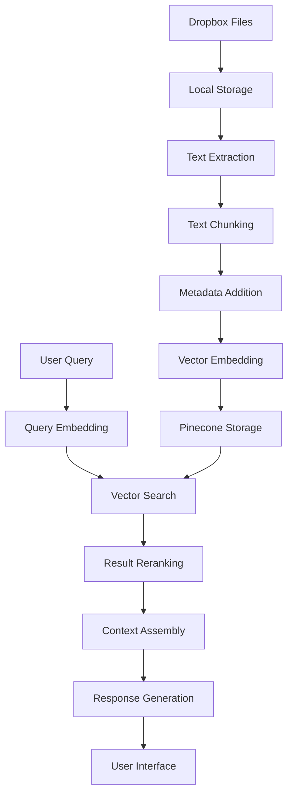

# Dropbox Chat Documentation

## Table of Contents
1. [Executive Summary](#executive-summary)
2. [System Architecture](#system-architecture)
3. [Backend Components](#backend-components)
4. [Frontend Components](#frontend-components)
5. [Data Flow](#data-flow)
6. [Setup and Installation](#setup-and-installation)
7. [User Guide](#user-guide)
8. [Technical Reference](#technical-reference)
9. [Troubleshooting and FAQs](#troubleshooting-and-faqs)
10. [Future Enhancements](#future-enhancements)

## Executive Summary

### Overview
Dropbox Chat is an AI-powered application that enables users to interact with their Dropbox files through natural language queries. The application connects to a user's Dropbox account, downloads and processes their files, and creates embeddings that allow for semantic search and question answering capabilities.

### Key Features
- **Dropbox Integration**: Secure OAuth2 authentication with Dropbox
- **File Synchronization**: Download and track changes to files in Dropbox
- **Document Processing**: Extract text from various document formats
- **Semantic Search**: Vector-based search using OpenAI embeddings
- **Conversational AI**: Chat interface for querying document content
- **Web-Viewable Links**: Generate browser-friendly links to source documents

### Target Users
- Knowledge workers who need to quickly find information in their documents
- Researchers managing large collections of papers and references
- Teams collaborating on document-heavy projects
- Anyone who wants to chat with their Dropbox content using natural language

## System Architecture

### High-Level Architecture Diagram



### Component Interaction Flow



### Technology Stack

| Component | Technology | Description |
|-----------|------------|-------------|
| Frontend | React | JavaScript library for building user interfaces |
| Backend | FastAPI | Modern Python web framework for building APIs |
| Authentication | OAuth 2.0 | Industry-standard protocol for authorization |
| Document Processing | Unstructured API | Extract text from various document formats |
| Embeddings | OpenAI | Generate vector embeddings for semantic search |
| Vector Database | Pinecone | Store and query vector embeddings |
| Reranking | Cohere | Improve search relevance through reranking |
| Language Model | OpenAI | Generate natural language responses |

### Integration with External Services

#### Dropbox API
- **Authentication**: OAuth 2.0 flow for secure access
- **File Operations**: List, download, and create shared links
- **Permissions**: Read-only access to user files

#### OpenAI API
- **Embeddings**: text-embedding-3-small model for vector generation
- **Chat Completion**: gpt-4o-mini model for response generation

#### Pinecone
- **Vector Storage**: Store document embeddings
- **Similarity Search**: Find relevant documents based on query vectors
- **Namespace Management**: Organize vectors by user/application

#### Cohere
- **Reranking**: Improve search relevance with rerank-v3.5 model
- **Context Compression**: Filter and prioritize most relevant content

## Backend Components

### API Endpoints

| Endpoint | Method | Description | Parameters |
|----------|--------|-------------|------------|
| `/connect` | GET | Initiate Dropbox OAuth flow | None |
| `/oauth2callback` | GET | Handle OAuth callback | `code`, `state` |
| `/status` | GET | Check connection status | None |
| `/list_files` | GET | List files in Dropbox | None |
| `/sync` | GET | Download new/updated files | None |
| `/embed` | GET | Process and embed file content | None |
| `/chat` | POST | Query embedded documents | `user_query` |
| `/disconnect` | GET | Disconnect from Dropbox | None |
| `/set-openai-key` | POST | Set OpenAI API key | `api_key` |

### Authentication Flow



### File Processing Pipeline



### Embedding and Vector Search Implementation

The application uses a sophisticated approach to document processing and retrieval:

1. **Document Loading**: Uses UnstructuredAPIFileLoader to extract text from various file formats
2. **Text Chunking**: Implements EnhancedDocumentSplitter for intelligent document segmentation
3. **Metadata Enrichment**: Adds source information and web-viewable links to chunks
4. **Vector Embedding**: Uses OpenAI's text-embedding-3-small model for semantic representation
5. **Vector Storage**: Stores embeddings in Pinecone with document metadata
6. **Retrieval**: Implements a two-stage retrieval process:
   - Initial retrieval of candidate documents using vector similarity
   - Reranking of candidates using Cohere's rerank-v3.5 model
7. **Response Generation**: Uses OpenAI's gpt-4o-mini to generate answers based on retrieved context

### Chat Functionality

The chat endpoint implements Retrieval-Augmented Generation (RAG) with the following components:

1. **Query Processing**: Convert user query to vector using OpenAI embeddings
2. **Retrieval**: Find relevant document chunks in Pinecone
3. **Reranking**: Use Cohere to improve relevance of retrieved chunks
4. **Context Assembly**: Combine retrieved chunks into context window
5. **Response Generation**: Generate answer using OpenAI with retrieved context
6. **Source Attribution**: Include document sources with web-viewable links

## Frontend Components

### User Interface Overview

The React frontend provides a simple, functional interface with the following main sections:

1. **Connection Status**: Shows whether the user is connected to Dropbox
2. **Action Buttons**: Connect, List Files, Sync, Embed, and Disconnect
3. **Chat Interface**: Text input for queries and display area for responses
4. **File List**: Display of files in the user's Dropbox
5. **Sync Summary**: Details about the most recent sync operation
6. **Embed Summary**: Information about the document processing results

### Key Screens and Components

#### Main Application Screen
```
+-----------------------------------------------+
| Dropbox AI Integration                        |
| Status: Connected                             |
+-----------------------------------------------+
| [List Files] [Sync Files] [Embed Data] [Disconnect] |
+-----------------------------------------------+
| Chat with Dropbox Data                        |
| +-----------------------------------+ [Ask]   |
| |                                   |         |
| +-----------------------------------+         |
|                                               |
| Answer:                                       |
| Lorem ipsum dolor sit amet...                 |
|                                               |
+-----------------------------------------------+
| Files in Dropbox:                             |
| • document1.pdf (file)                        |
| • document2.docx (file)                       |
| • folder1 (folder)                            |
+-----------------------------------------------+
| Sync Summary:                                 |
| Sync complete                                 |
| • Total Items: 10                             |
| • Folders Count: 2                            |
| • Files Count: 8                              |
| • New Downloads: 3                            |
| • Skipped Files: 5                            |
| • Unsupported Files: 0                        |
| • Failed Files: 0                             |
+-----------------------------------------------+
| Embed Summary:                                |
| Embedding complete                            |
| • Processed Files: document1.pdf, document2.docx |
| • Skipped Files: document3.pdf                |
| • Total Chunks: 25                            |
+-----------------------------------------------+
```

### User Interaction Flow



## Data Flow

### Data Processing Pipeline



### Storage Mechanisms

| Data Type | Storage Location | Purpose |
|-----------|------------------|---------|
| Dropbox Tokens | Session Storage | Authentication |
| Downloaded Files | Local Filesystem | Document processing |
| File Metadata | JSON File | Track file changes |
| Embedding Status | JSON File | Track processed files |
| Document Chunks | Text Files | Verification and debugging |
| Vector Embeddings | Pinecone | Semantic search |
| OpenAI API Key | JSON File | API authentication |

## Setup and Installation

### Prerequisites

- Python 3.8+ for backend
- Node.js 14+ for frontend
- Dropbox Developer Account
- OpenAI API Key
- Pinecone Account and API Key
- Cohere API Key
- Unstructured API Key (optional)

### Environment Variables

| Variable | Required | Description |
|----------|----------|-------------|
| `DROPBOX_APP_KEY` | Yes | Dropbox application key |
| `DROPBOX_APP_SECRET` | Yes | Dropbox application secret |
| `OPENAI_API_KEY` | Yes | OpenAI API key |
| `PINECONE_API_KEY` | Yes | Pinecone API key |
| `PINECONE_INDEX_NAME` | Yes | Pinecone index name |
| `COHERE_API_KEY` | Yes | Cohere API key |
| `UNSTRUCTURED_API_KEY` | No | Unstructured API key |
| `UNSTRUCTURED_API_URL` | No | Unstructured API URL |

### Installation Steps

#### Backend Setup
1. Clone the repository
2. Navigate to the backend directory: `cd Dropbox_chat/backend`
3. Create a virtual environment: `python -m venv venv`
4. Activate the virtual environment:
   - Windows: `venv\Scripts\activate`
   - macOS/Linux: `source venv/bin/activate`
5. Install dependencies: `pip install -r requirements.txt`
6. Create a `.env` file with required environment variables
7. Run the backend: `uvicorn backend:app --host localhost --port 8000`

#### Frontend Setup
1. Navigate to the frontend directory: `cd Dropbox_chat/frontend`
2. Install dependencies: `npm install`
3. Run the frontend: `npm start`

### Configuration Options

#### Backend Configuration
- Session secret key (in `backend.py`)
- CORS origins (default: `http://localhost:3000`)
- Document chunking parameters (chunk size, overlap)
- Retrieval parameters (number of documents, reranking settings)

#### Frontend Configuration
- Backend API URL (default: `http://localhost:8000`)
- UI customization in `App.js`

## User Guide

### Getting Started

1. **Launch the Application**
   - Start the backend server
   - Start the frontend application
   - Open a web browser to `http://localhost:3000`

2. **Connect to Dropbox**
   - Click the "Connect to Dropbox" button
   - Authorize the application in the Dropbox consent screen
   - You will be redirected back to the application

### Connecting to Dropbox

1. Click the "Connect to Dropbox" button
2. Log in to your Dropbox account if prompted
3. Review the permissions requested
4. Click "Allow" to grant access
5. Wait for the redirect back to the application

### Syncing Files

1. Click the "Sync Files" button
2. Wait for the sync process to complete
3. Review the sync summary:
   - Total items found
   - New downloads
   - Skipped files (unchanged)
   - Unsupported files
   - Failed files

### Chatting with Documents

1. Click the "Embed Data" button to process downloaded files
2. Wait for the embedding process to complete
3. Type your query in the input field
4. Click "Ask" to submit your query
5. View the response, which includes:
   - Direct answer to your question
   - Source attribution with links to original documents

### Example Queries and Responses

#### Example 1: Finding Specific Information

**Query:** "What is the revenue forecast for Q3 2025?"

**Response:**
```
According to the financial projections document, the revenue forecast for Q3 2025 is $4.2 million, representing a 15% increase over Q2 2025. The forecast is based on expected growth in the enterprise segment and the launch of two new product features scheduled for early Q3. [1]

---
###### Sources

[1] [Q3_2025_Financial_Projections.xlsx](https://www.dropbox.com/s/abc123/Q3_2025_Financial_Projections.xlsx?dl=0)
```

#### Example 2: Summarizing a Document

**Query:** "Summarize the main points of the product roadmap"

**Response:**
```
The product roadmap document outlines the following key initiatives for the next 12 months:

1. Q1 2025: Launch of mobile application with core functionality
2. Q2 2025: Integration with third-party analytics platforms
3. Q3 2025: AI-powered recommendation engine
4. Q4 2025: Enterprise SSO and advanced security features

The document emphasizes that the AI recommendation engine is the highest priority feature, with 40% of engineering resources allocated to its development. Customer feedback indicates this feature could increase user engagement by up to 35%. [1]

---
###### Sources

[1] [2025_Product_Roadmap.pdf](https://www.dropbox.com/s/def456/2025_Product_Roadmap.pdf?dl=0)
```

## Technical Reference

### API Reference

#### GET /connect
Initiates the Dropbox OAuth flow by redirecting the user to the Dropbox authorization page.

**Response:** Redirect to Dropbox OAuth page

#### GET /oauth2callback
Handles the OAuth callback from Dropbox, exchanges the authorization code for an access token.

**Query Parameters:**
- `code`: Authorization code from Dropbox
- `state`: State parameter for CSRF protection

**Response:** Redirect to frontend application

#### GET /status
Checks if the user is currently connected to Dropbox.

**Response:**
```json
{
  "connected": true
}
```

#### GET /list_files
Lists all files in the user's Dropbox.

**Response:**
```json
{
  "entries": [
    {
      ".tag": "file",
      "name": "document.pdf",
      "path_lower": "/document.pdf",
      "id": "id:abc123",
      "size": 12345,
      "rev": "abc123def456"
    },
    {
      ".tag": "folder",
      "name": "folder1",
      "path_lower": "/folder1",
      "id": "id:def456"
    }
  ],
  "cursor": "abc123",
  "has_more": false
}
```

#### GET /sync
Downloads new or updated files from Dropbox.

**Response:**
```json
{
  "message": "Sync complete",
  "total_items": 10,
  "folders_count": 2,
  "files_count": 8,
  "new_downloads_count": 3,
  "skipped_files_count": 5,
  "unsupported_files_count": 0,
  "failed_files_count": 0,
  "downloaded_files": ["file1.pdf", "file2.docx", "file3.txt"],
  "skipped_files": ["file4.pdf", "file5.docx", "file6.txt", "file7.pdf", "file8.txt"],
  "unsupported_files": [],
  "failed_files": []
}
```

#### GET /embed
Processes downloaded files and embeds them into Pinecone.

**Response:**
```json
{
  "message": "Embedding complete",
  "processed_files": ["file1.pdf", "file2.docx", "file3.txt"],
  "processed_count": 3,
  "skipped_files": ["file4.pdf", "file5.docx"],
  "skipped_count": 2,
  "failed_files": [],
  "failed_count": 0,
  "total_chunks": 25,
  "chunks_verification_dir": "/path/to/chunks"
}
```

#### POST /chat
Queries the embedded documents and returns a response.

**Request Body:**
```json
{
  "user_query": "What is the revenue forecast for Q3 2025?"
}
```

**Response:** Streaming text response

#### GET /disconnect
Disconnects from Dropbox and clears all local data.

**Response:**
```json
{
  "message": "Disconnected from Dropbox and all data has been deleted",
  "details": {
    "session_cleared": true,
    "pinecone_embeddings_deleted": true,
    "downloaded_files_deleted": true,
    "chunks_deleted": true,
    "mappings_reset": true,
    "api_key_deleted": true
  },
  "success": true
}
```

#### POST /set-openai-key
Sets the OpenAI API key.

**Request Body:**
```json
{
  "api_key": "sk-..."
}
```

**Response:**
```json
{
  "message": "OpenAI API key stored successfully",
  "status": "success"
}
```

### Performance Considerations

| Operation | Expected Time | Factors |
|-----------|---------------|---------|
| OAuth Flow | 2-5 seconds | Network latency, Dropbox response time |
| List Files | 1-10 seconds | Number of files, Dropbox API latency |
| Sync Files | 10-300 seconds | Number and size of files, file types |
| Embed Data | 30-600 seconds | Number and size of files, OpenAI API latency |
| Chat Query | 2-10 seconds | Query complexity, number of relevant documents |

### Security Considerations

1. **Authentication**
   - OAuth 2.0 for secure Dropbox authentication
   - No storage of Dropbox passwords
   - Session-based authentication with CSRF protection

2. **Data Storage**
   - Files stored locally only during processing
   - No persistent storage of file contents after embedding
   - API keys stored in local files with restricted access

3. **API Security**
   - HTTPS for all API communications
   - API keys never exposed to frontend
   - Session middleware with secure cookies

4. **Privacy**
   - Minimal data collection
   - No sharing of user data with third parties
   - Clear data deletion on disconnect

## Troubleshooting and FAQs

### Common Issues and Solutions

#### Connection Issues

**Issue:** Unable to connect to Dropbox
**Solution:**
- Check internet connection
- Verify Dropbox credentials
- Ensure Dropbox API is available
- Check that redirect URI matches Dropbox app settings

#### Sync Issues

**Issue:** Files not downloading
**Solution:**
- Verify Dropbox connection status
- Check file permissions in Dropbox
- Look for error messages in sync summary
- Ensure sufficient disk space for downloads

#### Embedding Issues

**Issue:** Embedding process fails
**Solution:**
- Verify OpenAI API key is valid
- Check Pinecone API key and index name
- Ensure downloaded files are accessible
- Look for specific error messages in embed summary

#### Chat Issues

**Issue:** No response or irrelevant answers
**Solution:**
- Verify files have been successfully embedded
- Check if query is related to embedded content
- Try rephrasing the question
- Ensure OpenAI API key has sufficient quota

### Frequently Asked Questions

#### General Questions

**Q: What file types are supported?**
A: The application supports most text-based file formats including PDF, DOCX, TXT, CSV, XLSX, PPTX, HTML, and more. Binary files like images and videos are not supported.

**Q: How much does it cost to use?**
A: The application itself is free, but you need API keys for OpenAI, Pinecone, and optionally Cohere and Unstructured. These services have their own pricing models, typically with free tiers available.

**Q: Is my data secure?**
A: Yes, the application only stores your files locally during processing. After embedding, the original files can be deleted. All API communications use secure HTTPS connections.

#### Technical Questions

**Q: How are documents processed?**
A: Documents are downloaded from Dropbox, processed to extract text, split into chunks, embedded using OpenAI's embedding model, and stored in Pinecone for retrieval.

**Q: How does the chat functionality work?**
A: The application uses Retrieval-Augmented Generation (RAG). Your query is converted to a vector, similar document chunks are retrieved from Pinecone, reranked for relevance, and then used as context for OpenAI's language model to generate a response.

**Q: Can I use a different embedding model?**
A: Yes, the code can be modified to use different embedding models. The current implementation uses OpenAI's text-embedding-3-small model.

## Future Enhancements

### Planned Features

1. **Multi-User Support**
   - User authentication and authorization
   - Separate vector namespaces per user
   - Role-based access control

2. **Advanced Document Processing**
   - Image and table extraction
   - Document structure preservation
   - Multi-language support

3. **Enhanced Retrieval**
   - Hybrid search (keyword + semantic)
   - Query expansion
   - Personalized ranking

4. **User Interface Improvements**
   - Document preview
   - Chat history
   - Feedback mechanisms
   - Mobile-responsive design

### Scalability Considerations

1. **Backend Scalability**
   - Asynchronous processing for large document sets
   - Queue-based architecture for embedding
   - Horizontal scaling of API servers

2. **Storage Optimization**
   - Tiered storage for documents
   - Compression techniques
   - Selective embedding

3. **Cost Management**
   - Caching mechanisms
   - Batch processing
   - Model quantization

### Integration Possibilities

1. **Additional Storage Providers**
   - Google Drive
   - OneDrive
   - Box
   - S3 and other cloud storage

2. **Collaboration Tools**
   - Slack
   - Microsoft Teams
   - Discord

3. **Productivity Applications**
   - Notion
   - Obsidian
   - Roam Research
