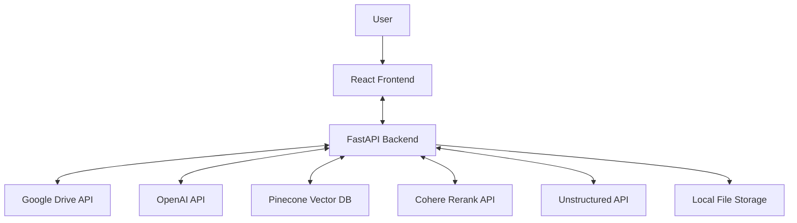
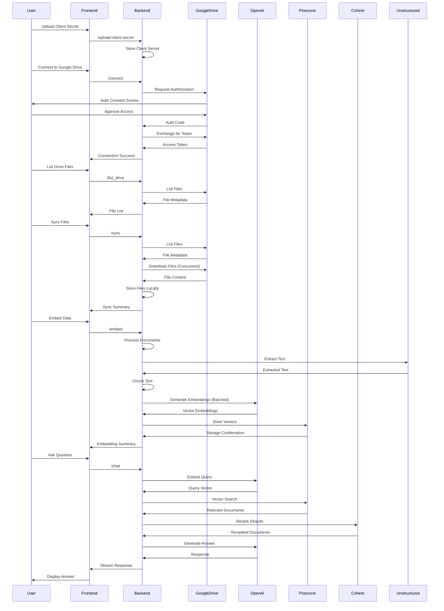
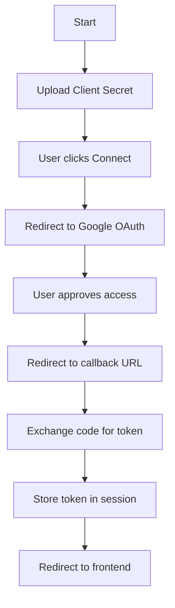
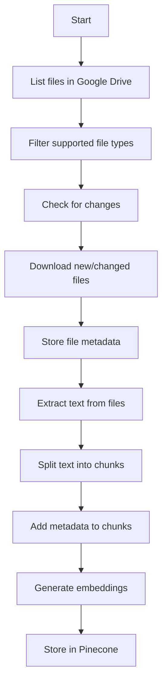
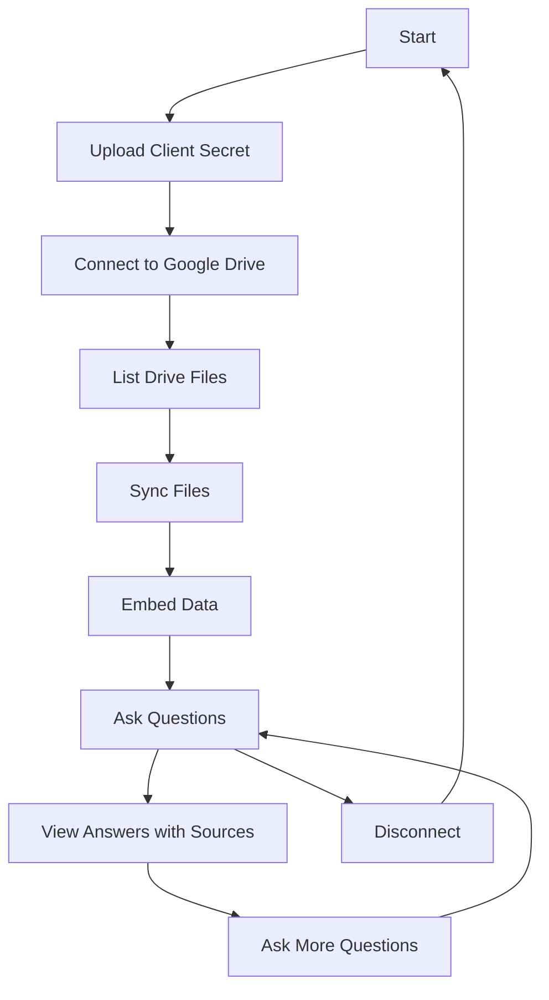
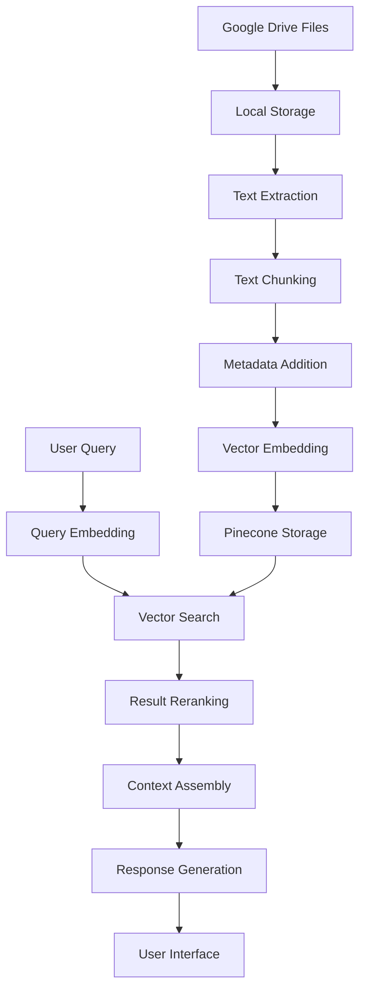

# Google Drive Chat Documentation

## Table of Contents
1. [Executive Summary](#executive-summary)
2. [System Architecture](#system-architecture)
3. [Backend Components](#backend-components)
4. [Frontend Components](#frontend-components)
5. [Data Flow](#data-flow)
6. [Setup and Installation](#setup-and-installation)
7. [User Guide](#user-guide)
8. [Technical Reference](#technical-reference)
9. [Troubleshooting and FAQs](#troubleshooting-and-faqs)
10. [Future Enhancements](#future-enhancements)

## Executive Summary

### Overview
Google Drive Chat is an AI-powered application that enables users to interact with their Google Drive files through natural language queries. The application connects to a user's Google Drive account, downloads and processes their files, and creates embeddings that allow for semantic search and question answering capabilities.

### Key Features
- **Google Drive Integration**: Secure OAuth2 authentication with Google Drive
- **File Synchronization**: Download and track changes to files in Google Drive
- **Document Processing**: Extract text from various document formats
- **Semantic Search**: Vector-based search using OpenAI embeddings
- **Conversational AI**: Chat interface for querying document content
- **Concurrent Processing**: Optimized file downloading and processing with async operations

### Target Users
- Knowledge workers who need to quickly find information in their documents
- Researchers managing large collections of papers and references
- Teams collaborating on document-heavy projects
- Anyone who wants to chat with their Google Drive content using natural language

## System Architecture

### High-Level Architecture Diagram



### Component Interaction Flow



### Technology Stack

| Component | Technology | Description |
|-----------|------------|-------------|
| Frontend | React | JavaScript library for building user interfaces |
| Backend | FastAPI | Modern Python web framework for building APIs |
| Authentication | OAuth 2.0 | Industry-standard protocol for authorization |
| Document Processing | Unstructured API | Extract text from various document formats |
| Embeddings | OpenAI | Generate vector embeddings for semantic search |
| Vector Database | Pinecone | Store and query vector embeddings |
| Reranking | Cohere | Improve search relevance through reranking |
| Language Model | OpenAI | Generate natural language responses |
| Concurrency | asyncio | Asynchronous I/O for concurrent operations |

### Integration with External Services

#### Google Drive API
- **Authentication**: OAuth 2.0 flow for secure access
- **File Operations**: List, download, and export Google Docs formats
- **Permissions**: Read-only access to user files

#### OpenAI API
- **Embeddings**: text-embedding-3-small model for vector generation
- **Chat Completion**: gpt-4o-mini model for response generation

#### Pinecone
- **Vector Storage**: Store document embeddings
- **Similarity Search**: Find relevant documents based on query vectors
- **Namespace Management**: Organize vectors by user/application

#### Cohere
- **Reranking**: Improve search relevance with rerank-v3.5 model
- **Context Compression**: Filter and prioritize most relevant content

#### Unstructured API
- **Document Processing**: Extract text from various file formats
- **Element Extraction**: Parse documents into structured elements

## Backend Components

### API Endpoints

| Endpoint | Method | Description | Parameters |
|----------|--------|-------------|------------|
| `/upload-client-secret` | POST | Upload Google API client secret | `file` |
| `/connect` | GET | Initiate Google OAuth flow | None |
| `/oauth2callback` | GET | Handle OAuth callback | `code`, `state` |
| `/list_drive` | GET | List files in Google Drive | None |
| `/sync` | GET | Download new/updated files | None |
| `/embed` | GET | Process and embed file content | None |
| `/chat-te` | POST | Query embedded documents | `user_query`, `namespace` |
| `/disconnect` | GET | Disconnect from Google Drive | None |
| `/set-openai-key` | POST | Set OpenAI API key | `api_key` |
| `/debug-files` | GET | Debug file paths and existence | None |
| `/embedding-status` | GET | Get embedding status | None |

### Authentication Flow



### File Processing Pipeline



### Embedding and Vector Search Implementation

The application uses a sophisticated approach to document processing and retrieval:

1. **Document Loading**: Uses UnstructuredAPIFileLoader to extract text from various file formats
2. **Text Chunking**: Implements sentence-based chunking with NLTK for intelligent document segmentation
3. **Metadata Enrichment**: Adds source information and Google Drive links to chunks
4. **Vector Embedding**: Uses OpenAI's text-embedding-3-small model for semantic representation
5. **Vector Storage**: Stores embeddings in Pinecone with document metadata
6. **Retrieval**: Implements a two-stage retrieval process:
   - Initial retrieval of candidate documents using vector similarity
   - Reranking of candidates using Cohere's rerank-v3.5 model
7. **Response Generation**: Uses OpenAI's gpt-4o-mini to generate answers based on retrieved context

### Optimized Processing

The application implements several optimizations for efficient file processing:

1. **Concurrent Downloads**: Uses asyncio to download multiple files simultaneously
2. **Semaphore Control**: Limits concurrent operations to prevent overwhelming resources
3. **Chunked Downloads**: Downloads files in chunks to handle large files efficiently
4. **Batch Processing**: Processes embeddings in batches for better API utilization
5. **Incremental Processing**: Only processes files that have changed since last embedding
6. **Status Tracking**: Maintains detailed status of embedded files for efficient updates

### Chat Functionality

The chat endpoint implements Retrieval-Augmented Generation (RAG) with the following components:

1. **Query Processing**: Convert user query to vector using OpenAI embeddings
2. **Retrieval**: Find relevant document chunks in Pinecone
3. **Reranking**: Use Cohere to improve relevance of retrieved chunks
4. **Context Assembly**: Combine retrieved chunks into context window
5. **Response Generation**: Generate answer using OpenAI with retrieved context
6. **Source Attribution**: Include document sources with Google Drive links

## Frontend Components

### User Interface Overview

The React frontend provides a simple, functional interface with the following main sections:

1. **Connection Setup**: Upload client secret and connect to Google Drive
2. **Action Buttons**: List Files, Sync, Embed, and Disconnect
3. **Chat Interface**: Text input for queries and display area for responses
4. **File List**: Display of files in the user's Google Drive
5. **Sync Summary**: Details about the most recent sync operation
6. **Embed Summary**: Information about the document processing results

### Key Screens and Components

#### Main Application Screen
```
+-----------------------------------------------+
| Google Drive AI Integration                   |
| Status: Connected                             |
+-----------------------------------------------+
| [List Files] [Sync Files] [Embed Data] [Disconnect] |
+-----------------------------------------------+
| Chat with Google Drive Data                   |
| +-----------------------------------+ [Ask]   |
| |                                   |         |
| +-----------------------------------+         |
|                                               |
| Answer:                                       |
| Lorem ipsum dolor sit amet...                 |
|                                               |
+-----------------------------------------------+
| Files in Google Drive:                        |
| • document1.pdf (file)                        |
| • document2.docx (file)                       |
| • folder1 (folder)                            |
+-----------------------------------------------+
| Sync Summary:                                 |
| Sync complete                                 |
| • Attempted Count: 10                         |
| • Downloaded Count: 3                         |
| • Skipped Existing Count: 5                   |
| • Skipped Unsupported Count: 2                |
| • Failed Count: 0                             |
+-----------------------------------------------+
| Embed Summary:                                |
| Embedding complete                            |
| • Processed Files: document1.pdf, document2.docx |
| • Skipped Files: document3.pdf                |
| • Total Chunks: 25                            |
+-----------------------------------------------+
```

### User Interaction Flow



## Data Flow

### Data Processing Pipeline



### Storage Mechanisms

| Data Type | Storage Location | Purpose |
|-----------|------------------|---------|
| Google Credentials | Session Storage | Authentication |
| Client Secret | Local Filesystem | API authentication |
| Downloaded Files | Local Filesystem | Document processing |
| File Metadata | JSON File | Track file changes |
| Embedding Status | JSON File | Track processed files |
| Document Chunks | Text Files | Verification and debugging |
| Vector Embeddings | Pinecone | Semantic search |
| OpenAI API Key | JSON File | API authentication |
| Logs | Log File | Debugging and monitoring |

## Setup and Installation

### Prerequisites

- Python 3.8+ for backend
- Node.js 14+ for frontend
- Google Cloud Platform Account
- Google Drive API Credentials
- OpenAI API Key
- Pinecone Account and API Key
- Cohere API Key
- Unstructured API Key

### Environment Variables

| Variable | Required | Description |
|----------|----------|-------------|
| `OPENAI_API_KEY` | Yes | OpenAI API key |
| `PINECONE_API_KEY` | Yes | Pinecone API key |
| `PINECONE_INDEX_NAME` | Yes | Pinecone index name |
| `COHERE_API_KEY` | Yes | Cohere API key |
| `UNSTRUCTURED_API_KEY` | Yes | Unstructured API key |
| `UNSTRUCTURED_API_URL` | Yes | Unstructured API URL |

### Installation Steps

#### Backend Setup
1. Clone the repository
2. Navigate to the backend directory: `cd Google_Drive_chat/backend`
3. Create a virtual environment: `python -m venv venv`
4. Activate the virtual environment:
   - Windows: `venv\Scripts\activate`
   - macOS/Linux: `source venv/bin/activate`
5. Install dependencies: `pip install -r requirements.txt`
6. Create a `.env` file with required environment variables
7. Run the backend: `uvicorn backend:app --host localhost --port 8000`

#### Frontend Setup
1. Navigate to the frontend directory: `cd Google_Drive_chat/frontend`
2. Install dependencies: `npm install`
3. Run the frontend: `npm start`

### Google Cloud Platform Setup

1. Create a new project in Google Cloud Console
2. Enable the Google Drive API
3. Configure OAuth consent screen
4. Create OAuth 2.0 Client ID credentials
5. Download the client secret JSON file
6. Upload the client secret to the application

### Configuration Options

#### Backend Configuration
- Session secret key (in `backend.py`)
- CORS origins (default: `*`)
- Document chunking parameters (chunk size, overlap)
- Retrieval parameters (number of documents, reranking settings)
- Concurrency settings (max_concurrent_downloads, semaphore limits)

#### Frontend Configuration
- Backend API URL (default: `http://localhost:8000`)
- UI customization in `App.js`

## User Guide

### Getting Started

1. **Launch the Application**
   - Start the backend server
   - Start the frontend application
   - Open a web browser to `http://localhost:3000`

2. **Upload Client Secret**
   - Obtain client secret JSON file from Google Cloud Console
   - Click the "Upload Client Secret" button
   - Select the client_secret.json file

3. **Connect to Google Drive**
   - Click the "Connect to Google Drive" button
   - Authorize the application in the Google consent screen
   - You will be redirected back to the application

### Connecting to Google Drive

1. Click the "Connect to Google Drive" button
2. Log in to your Google account if prompted
3. Review the permissions requested
4. Click "Allow" to grant access
5. Wait for the redirect back to the application

### Syncing Files

1. Click the "Sync Files" button
2. Wait for the sync process to complete
3. Review the sync summary:
   - Attempted count
   - Downloaded count
   - Skipped existing count
   - Skipped unsupported count
   - Failed count

### Chatting with Documents

1. Click the "Embed Data" button to process downloaded files
2. Wait for the embedding process to complete
3. Type your query in the input field
4. Click "Ask" to submit your query
5. View the response, which includes:
   - Direct answer to your question
   - Source attribution with links to original documents

### Example Queries and Responses

#### Example 1: Finding Specific Information

**Query:** "What is the revenue forecast for Q3 2025?"

**Response:**
```
Your Q3 2025 revenue forecast is $4.2 million, representing a 15% increase over Q2 2025 [1]. This forecast is based on expected growth in the enterprise segment and the launch of two new product features scheduled for early Q3.

---
###### Sources

[1] [Q3_2025_Financial_Projections.xlsx](https://drive.google.com/file/d/abc123/view) - Google Drive
```

#### Example 2: Locating a File

**Query:** "Where is my product roadmap document?"

**Response:**
```
Your product roadmap document is stored in Google Drive [1]. It's located in the "Strategic Planning" folder and was last updated on March 10, 2025.

---
###### Sources

[1] [2025_Product_Roadmap.pdf](https://drive.google.com/file/d/def456/view) - Google Drive
```

## Technical Reference

### API Reference

#### POST /upload-client-secret
Uploads the Google API client secret file.

**Request:** Form data with file named 'client_secret.json'

**Response:**
```json
{
  "message": "Client secret uploaded successfully",
  "file_path": "/path/to/client_secret.json"
}
```

#### GET /connect
Initiates the Google OAuth flow by redirecting the user to the Google authorization page.

**Response:** Redirect to Google OAuth page

#### GET /oauth2callback
Handles the OAuth callback from Google, exchanges the authorization code for an access token.

**Query Parameters:**
- `code`: Authorization code from Google
- `state`: State parameter for CSRF protection

**Response:** Redirect to frontend application

#### GET /list_drive
Lists all files in the user's Google Drive.

**Response:**
```json
{
  "files": [
    {
      "id": "abc123",
      "name": "document.pdf",
      "mimeType": "application/pdf",
      "webViewLink": "https://drive.google.com/file/d/abc123/view"
    },
    {
      "id": "def456",
      "name": "folder1",
      "mimeType": "application/vnd.google-apps.folder"
    }
  ],
  "total_items": 2,
  "folders_count": 1,
  "files_count": 1
}
```

#### GET /sync
Downloads new or updated files from Google Drive.

**Response:**
```json
{
  "message": "Sync complete",
  "attempted_count": 10,
  "downloaded_count": 3,
  "skipped_existing_count": 5,
  "skipped_unsupported_count": 2,
  "failed_count": 0,
  "downloaded_files": ["file1.pdf", "file2.docx", "file3.txt"],
  "skipped_existing_files": ["file4.pdf", "file5.docx", "file6.txt", "file7.pdf", "file8.txt"],
  "skipped_unsupported_files": ["video.mp4", "image.jpg"],
  "failed_files": []
}
```

#### GET /embed
Processes downloaded files and embeds them into Pinecone.

**Response:**
```json
{
  "message": "Extraction, chunking, and embedding complete. Total chunks: 25",
  "processed_files": ["file1.pdf", "file2.docx", "file3.txt"],
  "processed_count": 3,
  "skipped_files": ["file4.pdf", "file5.docx"],
  "skipped_count": 2,
  "failed_files": [],
  "failed_count": 0
}
```

#### POST /chat-te
Queries the embedded documents and returns a response.

**Request Body:**
```json
{
  "user_query": "What is the revenue forecast for Q3 2025?",
  "namespace": "gdrive_search"
}
```

**Response:** Streaming text response

#### GET /disconnect
Disconnects from Google Drive and clears all local data.

**Response:**
```json
{
  "message": "Disconnect complete",
  "details": {
    "session_cleared": true,
    "pinecone_embeddings_deleted": true,
    "downloaded_files_deleted": true,
    "mappings_deleted": true,
    "client_secret_deleted": true,
    "api_key_deleted": true
  },
  "success": true
}
```

#### POST /set-openai-key
Sets the OpenAI API key.

**Request Body:**
```json
{
  "api_key": "sk-..."
}
```

**Response:**
```json
{
  "message": "OpenAI API key stored successfully",
  "status": "success"
}
```

#### GET /debug-files
Debug endpoint to check file paths and existence.

**Response:**
```json
{
  "current_dir": "/path/to/backend",
  "mapping_folder": {
    "path": "/path/to/backend/mapping_data",
    "exists": true,
    "is_dir": true
  },
  "mapping_file": {
    "path": "/path/to/backend/mapping_data/download_mapping.json",
    "exists": true,
    "size": 1024
  },
  "embedding_status_file": {
    "path": "/path/to/backend/mapping_data/embedding_status.json",
    "exists": true,
    "size": 512
  },
  "download_folder": {
    "path": "/path/to/backend/downloaded_files",
    "exists": true,
    "is_dir": true,
    "file_count": 10
  },
  "embedding_status_content": {
    "entry_count": 5,
    "entries": ["file1.pdf", "file2.docx", "file3.txt", "file4.pdf", "file5.docx"]
  }
}
```

#### GET /embedding-status
Get the status of all embedded files.

**Response:**
```json
{
  "message": "Found 5 embedded files with 25 total chunks",
  "status": {
    "file1.pdf": {
      "file_key": "file1.pdf_1024_1615900800.0",
      "last_embedded": "2025-03-16T12:00:00.000Z",
      "chunks": 5
    },
    "file2.docx": {
      "file_key": "file2.docx_2048_1615900800.0",
      "last_embedded": "2025-03-16T12:00:00.000Z",
      "chunks": 10
    }
  },
  "total_embedded_files": 5,
  "total_chunks": 25,
  "not_embedded_files": ["file6.pdf", "file7.docx"],
  "not_embedded_count": 2
}
```

### Performance Considerations

| Operation | Expected Time | Factors |
|-----------|---------------|---------|
| OAuth Flow | 2-5 seconds | Network latency, Google API response time |
| List Files | 1-10 seconds | Number of files, Google API latency |
| Sync Files | 10-300 seconds | Number and size of files, file types, concurrency settings |
| Embed Data | 30-600 seconds | Number and size of files, OpenAI API latency, batch size |
| Chat Query | 2-10 seconds | Query complexity, number of relevant documents |

### Security Considerations

1. **Authentication**
   - OAuth 2.0 for secure Google authentication
   - No storage of Google passwords
   - Session-based authentication with CSRF protection

2. **Data Storage**
   - Files stored locally only during processing
   - No persistent storage of file contents after embedding
   - API keys stored in local files with restricted access

3. **API Security**
   - HTTPS for all API communications
   - API keys never exposed to frontend
   - Session middleware with secure cookies

4. **Privacy**
   - Minimal data collection
   - No sharing of user data with third parties
   - Clear data deletion on disconnect

## Troubleshooting and FAQs

### Common Issues and Solutions

#### Connection Issues

**Issue:** Unable to connect to Google Drive
**Solution:**
- Check internet connection
- Verify Google credentials
- Ensure Google Drive API is enabled
- Check that redirect URI matches Google Cloud Console settings

#### Sync Issues

**Issue:** Files not downloading
**Solution:**
- Verify Google Drive connection status
- Check file permissions in Google Drive
- Look for error messages in sync summary
- Ensure sufficient disk space for downloads

#### Embedding Issues

**Issue:** Embedding process fails
**Solution:**
- Verify OpenAI API key is valid
- Check Pinecone API key and index name
- Ensure downloaded files are accessible
- Look for specific error messages in embed summary
- Check the debug-files endpoint for file path issues

#### Chat Issues

**Issue:** No response or irrelevant answers
**Solution:**
- Verify files have been successfully embedded
- Check if query is related to embedded content
- Try rephrasing the question
- Ensure OpenAI API key has sufficient quota
- Check embedding-status endpoint for embedding confirmation

### Frequently Asked Questions

#### General Questions

**Q: What file types are supported?**
A: The application supports most text-based file formats including PDF, DOCX, TXT, CSV, XLSX, PPTX, HTML, and Google Workspace formats (Docs, Sheets, Slides). Binary files like images and videos are not supported.

**Q: How much does it cost to use?**
A: The application itself is free, but you need API keys for OpenAI, Pinecone, Cohere, and Unstructured. These services have their own pricing models, typically with free tiers available.

**Q: Is my data secure?**
A: Yes, the application only stores your files locally during processing. After embedding, the original files can be deleted. All API communications use secure HTTPS connections.

#### Technical Questions

**Q: How are Google Workspace files handled?**
A: Google Workspace files (Docs, Sheets, Slides) are exported as PDF before processing. This ensures consistent text extraction across all file types.

**Q: How does the chat functionality work?**
A: The application uses Retrieval-Augmented Generation (RAG). Your query is converted to a vector, similar document chunks are retrieved from Pinecone, reranked for relevance, and then used as context for OpenAI's language model to generate a response.

**Q: Can I use a different embedding model?**
A: Yes, the code can be modified to use different embedding models. The current implementation uses OpenAI's text-embedding-3-small model.

## Future Enhancements

### Planned Features

1. **Multi-User Support**
   - User authentication and authorization
   - Separate vector namespaces per user
   - Role-based access control

2. **Advanced Document Processing**
   - Image and table extraction
   - Document structure preservation
   - Multi-language support

3. **Enhanced Retrieval**
   - Hybrid search (keyword + semantic)
   - Query expansion
   - Personalized ranking

4. **User Interface Improvements**
   - Document preview
   - Chat history
   - Feedback mechanisms
   - Mobile-responsive design

### Scalability Considerations

1. **Backend Scalability**
   - Further optimization of concurrent processing
   - Queue-based architecture for embedding
   - Horizontal scaling of API servers

2. **Storage Optimization**
   - Tiered storage for documents
   - Compression techniques
   - Selective embedding

3. **Cost Management**
   - Caching mechanisms
   - Batch processing optimization
   - Model quantization

### Integration Possibilities

1. **Additional Google Services**
   - Google Docs real-time integration
   - Google Sheets data analysis
   - Google Calendar integration

2. **Collaboration Tools**
   - Slack
   - Microsoft Teams
   - Discord

3. **Productivity Applications**
   - Notion
   - Obsidian
   - Roam Research
